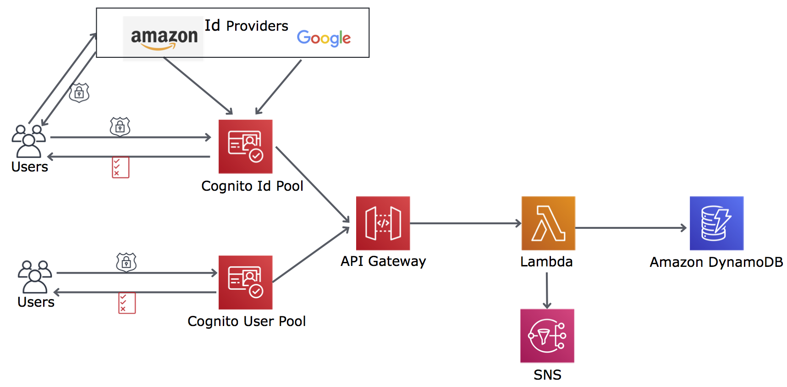

## Ticket Service : A fully functional concert ticket booking demo app

### Introduction
    TicketService is a demo web application to book concert tickets. 
    Its a simple fun application to demostrate security features of AWS Cognito. 
    
    AWS Cognito is used for Access control, sign-in and sign-up for the web application.
    
    Specifically AWS Cognito is used for -
    -   Identity Federation : Users can sign in through identity providers like Google and Amazon.
    -   Cognito User Pools : Users can create their identity in the secure user directory.
    
    In addition this application lets users reset their passwords.
___________________________________________________________________________________________________

### Hosting
##### This website is hosted on AWS S3 @ [TicketService](http://ticketservice-20190327092338-hostingbucket-prod.s3-website-us-east-1.amazonaws.com/)
___________________________________________________________________________________________________

### Technical Components
   
- Framework      : [AWS Amplify](https://aws-amplify.github.io/) 
- UI             : React 
- AuthN/AuthZ    : Cognito User Pool and Identity Federation from Amazon/Google 
- GraphQL        : CRUD operations 
- CloudFormation : Infrastructure 

___________________________________________________________________________________________________

### Architecture

___________________________________________________________________________________________________

### Steps to build and deploy -

##### 1.  Install [Node.js®](https://nodejs.org/en/download/) and [npm](https://www.npmjs.com/get-npm)

    Verify that you are running at least Node.js version 8.x or greater and npm version 5.x 
    or greater by running node -v and npm -v in a terminal/console window.

##### 2.  Install and configure the Amplify CLI.

    $ npm install -g @aws-amplify/cli
    $ amplify configure

##### 3.  Clone this repo

    $ git clone git@github.com:myGitLoginId/TicketServiceUsingAWSAmplify.git

##### 4.  Initialize Amplify
    From project root 
    $ cd tickerservice           | sub-dir consisting of amplify and app code.
    $ amplify init               | initialize your project.
    $ amplify env checkout prod  | checkout existing master/prod env.
    $ amplify env add            | (optional) initialize your own env.
    $ amplify push               | create env in AWS.

##### 5.  Run npm scripts (available scripts)
    From project root
    $ npm install                | First time install of dependent npm modules.
    $ npm start                  | Runs the app in the development mode.
    $ npm test                   | Launches the test runner in the interactive watch mode.
    $ npm run build              | Builds the app for production in the `build` folder.

___________________________________________________________________________________________________
